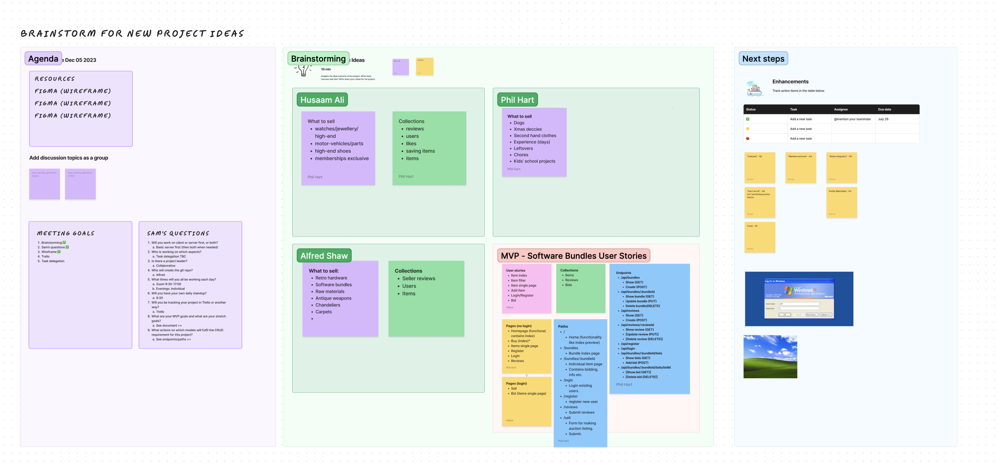

# Software-Seller
Software auction website

## Description

The purpose of this project was to create a functional back and front end application using JavaScript, React and SCSS using a self made API.

## Deployment link

Please find the website at the following link: 
https://software-seller-alfred-26948c7b1493.herokuapp.com/

## Getting Started/Code Installation

This code is hosted on Heroku. Please follow the link provided.

## Timeframe & Working Team

The timeframe for this project was 9 days, Wednesday the 6th of December at 12PM to Friday the 15th of December at 1PM. This project was a collaboration between Phil Hart and I.

## Technologies used

Technologies used are as follows:
<ul>
<li>VS code</li>
<li>Photoshop</li>
<li>Heroku</li>
<li>Firefox</li>
<li>Trello</li>
<li>FigJam and Figma</li>
<li>Chat GPT</li>
<li>Mongo DB</li>
</ul>

Packages for VS code used are as follows:
<ul>
<li>React</li>
<li>React router dom</li>
<li>Chakra</li>
<li>Bcrypt</li>
<li>Json Web Token</li>
<li>Express</li>
<li>Dotenv</li>
<li>Axios</li>
<li>XP.css</li>
<li>Sass</li>
<li>Mongoose</li>
</ul>

## Brief

This project was a test of fullstack development skills, including everything from purposeful styling to functional backend web communication. Using React and JavaScript, we were to make an API, access and manipulate a database based on client side interactions with the website.

### Technical Requirements:

* **Build a full-stack application** by making your own backend and your own front-end
* **Use an Express API** to serve your data from a Mongo database
* **Consume your API with a separate front-end** built with React
* **Be a complete product** which most likely means multiple relationships and CRUD functionality for at least a couple of models
* **Implement thoughtful user stories/wireframes** that are significant enough to help you know which features are core MVP and which you can cut
* **Have a visually impressive design** to kick your portfolio up a notch and have something to wow future clients & employers.
* **Be deployed online** so it's publicly accessible.

### Necessary Deliverables

* A **working app** hosted on the internet.
* A **link to your hosted working app** in the URL section of your Github repo.
* A **git repository hosted on Github**, with a link to your hosted project, and frequent commits dating back to the _very beginning_ of the project.
* A **`readme.md` file**

## Planning

Planning the website consisted of several stages due to the scale of this project. To begin, FigJam was used to generate ideas and place down a set of initial guidelines for us to take with the site.
Following this, a wireframe was made to represent all of the pages intended to be on the site.
Next, a Trello board was created, which was populated with basic tasks and deliverables that were used and updated continuously throughout the project.
Tasks to complete were split up between Phil and I. I was responsible for index pages, API requests and certain styling aspects (as well as resources for the theme).

### FigJam:

Link:
https://www.figma.com/file/kEEU3qBAPuH2CgWsmVtSCx/Software-Seller?type=whiteboard&node-id=6-161&t=C7q8lDtkuinpB5LF-0

 
The FigJam was simply used to brainstorm ideas and create a basic structure for starting the project, including deliverables, user stories etc.

### Wireframe:

Link:
https://www.figma.com/file/SYfXNB8m3Btd7w9l1L1T6w/Software-Seller?type=design&node-id=30-2&mode=design&t=WHB1BAwBFzFgLdxK-0

 
Wireframes for each page were created in Figma. These follow the initial concepts from the FigJam board as a general guideline. The final product differs in structure, but uses the same components, as we had decided on a set styling format to follow.

### Trello:

Link:
https://trello.com/b/OnN85z0M/software-seller

 
The trello page was the main documentation for planning and progress during the project. We used it for task delegation, ongoing bug reporting, updates and features and user stories. This helped us keep track of time and progress throughout the project. The trello board brings together all aspects of planning, from the basic story we want the whole site to follow, which we used instead of pseudo code, to the initial documentation and final user bug reports.

## Build/Code Process

The main code is built up of many sub sections separated into 2 main sections. These are the client side and the server side. The sections shown below were my highlighted contributions to the project.

### Client:

The client side consists of the front end the user interacts with, the styling and JavaScript for loading in API data. For the client side, React was mainly used for site navigation, with chakra used for some parts of front end functionality such as our start menu.
The front end uses loaders, which are javascript functions to retrieve API data. The intention of the front end is to be as light on the user's end as possible, so information that is displayed on the client is usually requested on page load and then interpreted, such as the countdown timers for the auction ends.
To create the styled theme of the website, a package called XP.css was used. This was used for the majority of the windows and blue bars on the client side. The rest, such as the menus and navigation bars were built up from scratch using react, photoshop and picture references from google.

**Code showcase:**

Toolbar:

On most windows, a toolbar was created to mimic the toolbar for windows. This was primarily made up of react, using react HTML and SCSS. Below is the react HTML to show the approach to creating it.

The code:

    

      
Bought items

      

        <button aria-label="Minimize" />
        <button aria-label="Maximize" />
        <button aria-label="Close" />
      

    

    

      

        

          
File

          
Edit

          
View

          
Favourites

          
Tools

          
Help

        

        

          

        

      

      

        

          
          
Back

        

        

          
        

        

          
        

        <section className='separator'></section>
        

          
          
Search

        

        

          
          
Folders

        

        <section className='separator'></section>
        

          
        

      

    

Loaders:

The loaders used in the client side used API requests that were created to obtain the relevant data instead of querying from every part of the API. Additionally, authentication was created for some of them, such as retrieving bids, as these are tied to a specific user. These also included redirects that would not allow users to access the pages the loaders were used on if their authorisation was missing.

The code:

    // & Functions

    export async function getActiveBundles() {
      const res = await fetch('/api/bundles/active')
      return res.json()
    }

    export async function getSingleBundle(id){
      const res = await fetch(`/api/bundles/${id}`)
      return res.json()
    }

    export async function getAllReviews() {
      const res = await fetch('/api/reviews')
      return res.json()
    }

    // & Bought user bundles

    export async function getBoughtBundles() {
      const res = await axios.get('/api/bought', {
        validateStatus: () => true,
        headers: {
          Authorization: `Bearer ${getToken()}`
        }
      })
      if (!getToken()) {
        return redirect("/login");
      }
      return res.data
    }

    // & Sold user bundles

    export async function getSoldBundles() {
      const res = await axios.get('/api/sold', {
        validateStatus: () => true,
        headers: {
          Authorization: `Bearer ${getToken()}`
        }
      })
      if (!getToken()) {
        return redirect("/login");
      }
      return res.data
    }

### Server:

The server side consists of backend processes and building, such as functions for CRUD functionality on the API, as well as creating data in the API in the first place through seeding files.
Additional methods were coded into the server side for functionality that we needed, which resulted in single API requests made on the client side returning back the data we needed instead of loading large amounts of unused data and then filtering it all out.
We created a seed that can be used to demonstrate the timed functionality of the website without removing all active users and history of bids. The command for this function is defined in the package.json file on the server side.

**Code showcase:**

Bundle controllers:

As the auction site would need to query the auctioned items multiple times for different sets of data, our bundle controller file for the API consisted of more specific requests, tied to users and requiring authentication. This allows the front end to be making light API requests and minimise loading unnecessary data. This structure was repeated for the bid data, as they are user tied and need to be referenced at certain points. For certain queries, we use the .populate function that allows us to bring in virtual fields to the data coming out of the API request.

The code:

    import Bundle from '../models/bundle_model.js'

    // & Index
    // ? GET
    // * /bundles

    export const getAllBundles = async (req, res) => {
      const bundles = await Bundle.find().populate('winDetails')
      return res.json(bundles)
    }

    // & Index active
    // ? GET
    // * /bundles/active

    export const getActiveBundles = async (req, res) => {
      const bundles = await Bundle.find( { auctionEnd: { $gte: new Date() } } ).populate('winDetails')
      return res.json(bundles)
    }

    // & Index - user specific (owner)
    // ? GET
    // * /sold

    export const getSoldBundles = async (req, res) => {
      const bundles = await Bundle.find( { owner: req.currentUser._id  } ).populate('winDetails')
      return res.json(bundles)
    }

    // & Create
    // ? POST
    // * /bundles

    export const createBundle = async (req, res) => {
      try {
        req.body.owner = req.currentUser._id
        const bundleToCreate = (await Bundle.create(req.body))
        return res.status(201).json(bundleToCreate)
      } catch (error) {
        console.log(error)
        return res.status(400).json({ message: 'Invalid input, check required fields' })
      }
    }

    // & Get One
    // ? GET
    // * /bundles/:bundleId

    export const getSingleBundle = async (req, res) => {
      try {
        const { bundleId } = req.params
        const bundle = await Bundle.findById(bundleId).populate('owner').populate('winDetails').populate('bids')
        if (!bundle){
          return res.status(404).json({ message: 'Bundle not found' })
        }
        // ? If the bundle exists
        return res.json(bundle)
      } catch (error) {
        console.log(error)
        return res.status(400).json(error)
      }
    }

    // & Update
    // ? PUT
    // * /bundles/:bundleId

    export const updateBundle = async (req, res) => {
      try {
        const { bundleId } = req.params
        const bundle = await Bundle.findById(bundleId)
        if (!bundle) {
          return res.status(404).json({ message: 'Bundle not found ' })
        }
        if (!bundle.owner.equals(req.currentUser._id)){
          return res.status(401).json({ message: 'Unauthorized' })
        }
        Object.assign(bundle, req.body)
        await bundle.save()
        return res.json(bundle)
      } catch (error) {
        console.log(error)
        return res.status(400).json(error)
      }
    }

    // & Delete
    // ? DELETE
    // * /bundles/:bundleId

    export const deleteBundle = async (req, res) => {
      try {
        const { bundleId } = req.params
        const bundle = await Bundle.findOneAndDelete({ _id: bundleId, owner: req.currentUser._id })
        if (!bundle) {
          return res.status(404).json({ message: 'Bundle not found : unauthorized' })
        }
        return res.sendStatus(204)
      } catch (error) {
        console.log(error)
        return res.status(400).json(error)
      }
    }

Virtual fields:

For our bidding system, we created virtual fields that will be linked to each bundle. The two virtual fields consist of the max bid on an item (and the owner of that bid) and all the bids placed on an item. These virtual fields were defined in the bundle model along with the bundle schema.

The code:

    import mongoose from 'mongoose'

    // & Bundle schema
    const bundleSchema = new mongoose.Schema({
      software: { type: String, required: true },
      version: { type: String, required: true },
      operatingSystem: { type: String, required: true },
      releaseYear: Number,
      description: String,
      image: String,
      startPrice: { type: Number, required: true, min: 1 },
      auctionEnd: { type: Date, required: true },
      owner: { type: mongoose.ObjectId, ref: 'User', required: true }
    })

    // * Allow virtuals
    bundleSchema
      .set('toJSON',{
        virtuals: true,
    })

    // * Virtual field for maxBid
    bundleSchema
      .virtual('winDetails', {
        ref: 'Bid',
        localField: '_id',
        foreignField: 'bundle',
      })
      .get(function(bids){
        if (bids == '') {
          return { maxBid: 0, winner: 'No one bid :(' }
        } else {
          return { maxBid: bids?.sort((a, b) => a.value - b.value)[bids.length - 1].value, winner: bids?.sort((a, b) => a.value - b.value)[bids.length - 1].owner }
        }
      })

    // * Virtual field for bids
    bundleSchema
      .virtual('bids', {
        ref: 'Bid',
        localField: '_id',
        foreignField: 'bundle',
      })

    // * Virtual field for winningBid
    bundleSchema
      .virtual('winner', {
        ref: 'Bid',
        localField: '_id',
        foreignField: 'bundle',
      })
      .get(function(bids){
        if (bids == '') {
          return
        } else {
          return bids?.sort((a, b) => a.value - b.value)[bids.length - 1].owner
        }
      })

    export default mongoose.model('Bundle', bundleSchema)

## Challenges

The main challenge for this project was working with back end coding for the first time. Most of the front end was familiar, but the back end process such as hashing passwords, generating API paths etc was brand new, so understanding errors being thrown, and problem solving them took longer than usual. Overall, using methods for mongoose proved challenging at first, but very useful and beneficial for functionality in the long term of the project.
During our project, we had large amounts of data that we wanted to cross reference, so we started creating multiple virtual fields. These presented multiple issues, such as not being able to query by these. Luckily, through usage of populate fields, we were able to get around this, but mongo DB virtual fields proved to be a challenge to work with efficiently.
Finally, as we were set on a theme for styling, much time was put into figuring out fixes and ways to create a faithful styling replication of sections of windows XP. This proved to be more of a task than initially planned due to the fact the CSS package we found was mainly a few borders for windows, so we had to create lots of styling from scratch.

## Wins

The styling of our website came out very well. It manages to look very much like Windows XP, but keeps the functionality of a real auction site. 
Additionally, the API requests are very light for the functionality on the website due to using mongoose methods on API paths. I am proud of this as it means page loading is very fast. This is important as over time parts of the database will start to become very bloated with information (such as new bids on items and logs of items sold etc).
I was happy with the react logic as well. The logic allowed for multiple timers to run on the pages which only make one request to the API. They then use logic to count down based on the data received on the user end about the auction end dates, instead of making new API requests to update.

## Key Learnings/Takeaways

Using mongoose methods, I have learnt a lot about manipulating API information through backend paths, and keeping information sent to the frontend to a minimum to help keep the site running quickly and efficiently.
I have also learnt a lot about using mongo DBs virtual fields, and how querying this kind of data can be quite difficult, which can be avoided with more in depth API path planning to make sure data that is needed can be accessed.
The majority of this project was putting most of the backend skills we have seen in lectures into practice and seeing what works and what doesn't to learn more about each section.

## Bugs

The website is not responsive on phones.
On mobile devices, there is a strange formatting issue with the lower toolbar that is related to the clock interval timer.

## Future Improvements

<li>Fixing of all bugs listed above.</li>
<li>Add mobile device responsiveness</li>
<li>Finish the page that shows all the bids a user has made on items (even ones they are not winning).</li>
<li>Integrate stripe payment method into the page displayed when you win an item.</li>
<li>Add the ability to save auctions to a watchlist.</li>
<li>Improve some front end UI and instructional areas to make navigation clearer.</li>

